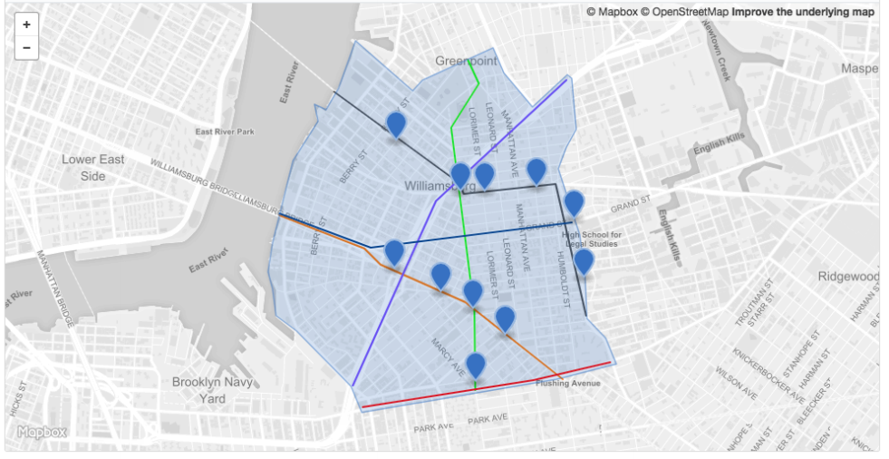
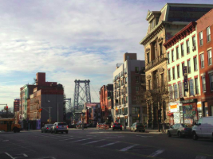
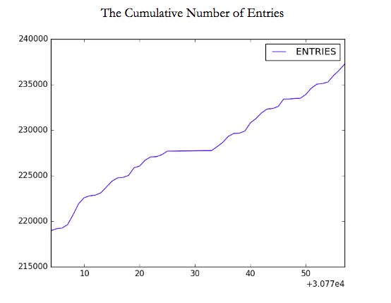
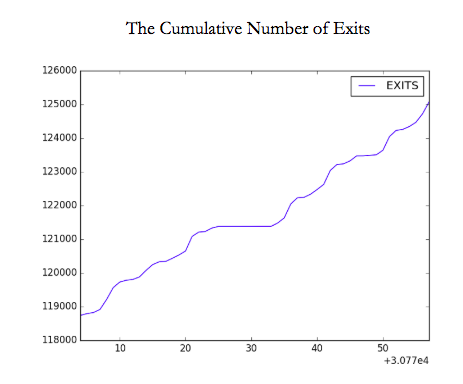
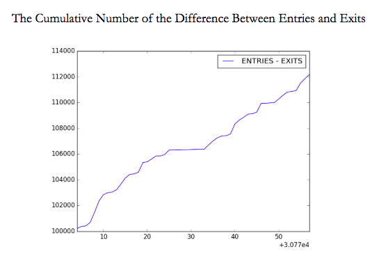

## Welcome to my GitHub Page! 

Below you will find the following aspects about Williamsburg:
1. The outline of the neighborhood (via JSON)
2. The basic demographics and statistics of the neighborhood
3. Bedford Av.'s station usage statistics

### The outline of Williamsburg (via JSON)

### The basic demographics and statistics of Williamsburg

For the L-train tunnel closure project, I chose to study the impact of the construction on a neighborhood in Brooklyn named Williamsburg. 
Zip codes: 11211 and 11206. 
Census tracts: 0477.00, 0489.00, 0491.00, 0493.00, 0495.00, 0497.00, 0499.00, 0501.00, 0503.00, 0505.00, 0507.00, 0509.00, 0511.00, 0513.00, 0515.00, 0517.00, 0519.00, 0523.00, 0525.00, 0527.00, 0529.00, 0531.00, 0533.00, 0535.00, 0537.00, 0539.00, 0545.00, 0547.00, 0549.00, 0551.00, 0553.00, 0555.00, 0557.00, 0569.00, 0571.00. 
Population: 138,984
Homes: 51,151 homes
Ethnicity Breakdown: 56.5% White, 25.8% Hispanic, 9.5% Black, and 6.5% Asian. 
Married/Single: 35.6% are married, 13.9% are single females, and 4% are single males. 
Employment: 61.2% 
Education: 41.9% having post-secondary education, and 36.1% holding a high school diploma
Median income: $54,400. 
The distance from Williamsburg to Federal Hall stretches about 3 miles and to the Empire State building about 4 miles.

### Picture of Williamsburg

South Williamsburg streetscape, featuring 
Manhattan Bridge.

### Bedford Av.'s station usage statistics
1. Name of station: Bedford Av.
2. Turnstile name: 00-00-00
3. Number of entries for the turnstile the week of 8/25/18: 0000237254 - 0000218959 = 18295 entries
4. Number of exits for the turnstile the week of 8/25/18: 0000125071 - 0000118739 = 6332 exits

### Turnstile Data

